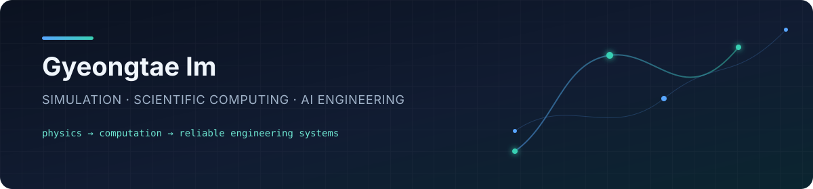
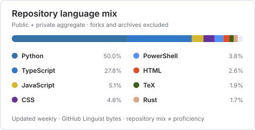
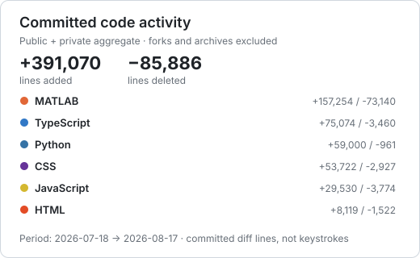

# Gyeongtae Im

**Mechanical engineer and research-software builder working at the intersection of physics-based simulation, scientific machine learning, and reliable automation.**

I turn complex physical problems into reproducible computational workflows—from CFD and multiphysics studies to surrogate models, engineering applications, and agent-assisted research systems.

> **Model the physics. Automate the repeatable work. Validate the result. Deliver a tool people can trust.**

## What I work on

| Area | Questions I focus on | Typical output |
| --- | --- | --- |
| **Safety-critical simulation** | How do releases, dispersion, ventilation, and fire evolve in real systems? | CFD studies, defensible assumptions, and risk-aware decision support |
| **Scientific ML** | How can surrogate models, PINNs, and explainability accelerate physics-based analysis without hiding uncertainty? | Reproducible experiments and validation-first predictive workflows |
| **Engineering automation** | Which manual simulation and analysis steps can be made reliable, traceable, and reusable? | Python automation, desktop tools, data pipelines, and CI-backed utilities |
| **Agentic research systems** | How can LLM agents support research while keeping evidence, state, and decisions inspectable? | MCP/LangGraph workflows, controlled experiment loops, and research tooling |

## Selected public work

| Project | What it demonstrates |
| --- | --- |
| [**delivery-graph**](https://github.com/darkwingduck-code/delivery-graph) | A guardrailed software-delivery pipeline combining LangGraph, Amazon Bedrock, GitHub, optional Playwright RPA, and AWS orchestration, with schema validation, deterministic policy checks, human approval, tests, and CI. |
| [**repo-health-check**](https://github.com/darkwingduck-code/repo-health-check) | A non-mutating PowerShell repository health checker with human-readable and JSON output, clean-tree enforcement, upstream sync reporting, integration tests, and Windows CI. |
| [**darkwingduck-code.github.io**](https://github.com/darkwingduck-code/darkwingduck-code.github.io) | A deployed technical-notes platform covering simulation, scientific computing, ML, and reliable delivery, with sensitive-content auditing, Jekyll validation, link checks, and GitHub Pages CI/CD. |
| [**windows-usb-input-recovery**](https://github.com/darkwingduck-code/windows-usb-input-recovery) | Risk-tiered Windows USB/HID diagnostics and recovery scripts with `-WhatIf` support, explicit controller-level safeguards, recovery guidance, and privacy boundaries. |
| [**github-profile-blog-playbook**](https://github.com/darkwingduck-code/github-profile-blog-playbook) | A documented operating system for professional GitHub profiles and technical blogs, including privacy-aware language analytics, Actions security, reusable templates, and release guidance. |
| [**git-pr-learning-lab**](https://github.com/darkwingduck-code/git-pr-learning-lab) | A Korean-first, beginner-friendly Git and pull-request learning lab with guided exercises, quick starts, troubleshooting, contribution rules, and an English entry point. |

## Engineering toolkit

**Modeling & research**  
CFD · Multiphysics · Transport phenomena · Hydrogen safety · Fire dynamics · Surrogate modeling · Explainable AI

**Software & automation**  
Python · PyTorch · TypeScript · PowerShell · PySide6 · MCP · LangGraph · Docker · GitHub Actions

**Working principles**  
Reproducibility · Verification before claims · Explicit assumptions · Reviewable changes · Usable interfaces

## Technology snapshot

  

  
  
  
  
  
  
  
  
  

## Research profile

- M.S. in Mechanical Engineering
- Research interests: scientific ML, simulation automation, hydrogen and fire safety, optimization, and trustworthy engineering AI
- Publications and research record: [ORCID 0000-0001-6517-523X](https://orcid.org/0000-0001-6517-523X)
- Reproducible technical notes: [darkwingduck-code.github.io](https://darkwingduck-code.github.io)

## Repository snapshot

Updated weekly from the GitHub API. Percentages aggregate language bytes across public and private non-fork, non-archived repositories; repository names and source code remain private. This describes repository composition, not proficiency.

## Code activity snapshot

The displayed lookup period covers owned public and private non-fork, non-archived repositories. Counts are committed diff lines grouped by file extension—not keystrokes—and exclude common generated, dependency, build, and lock files. Repository names, paths, and commit identifiers remain private.
